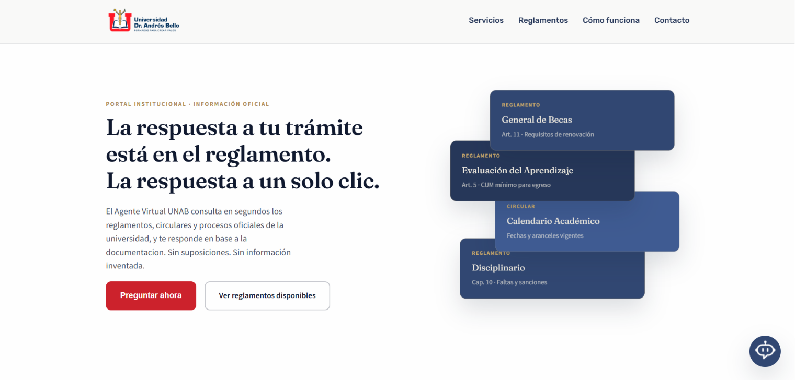
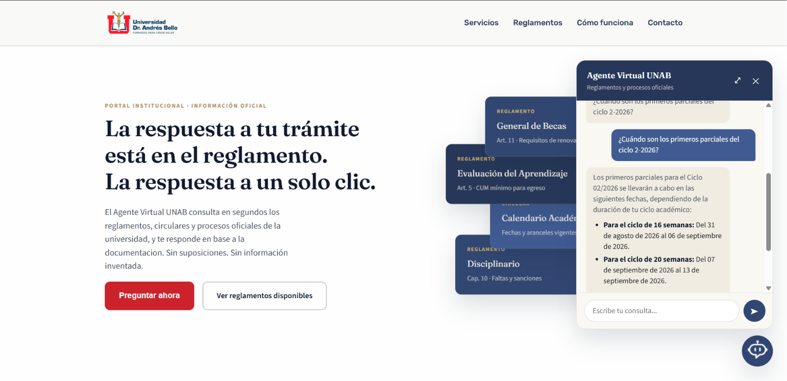
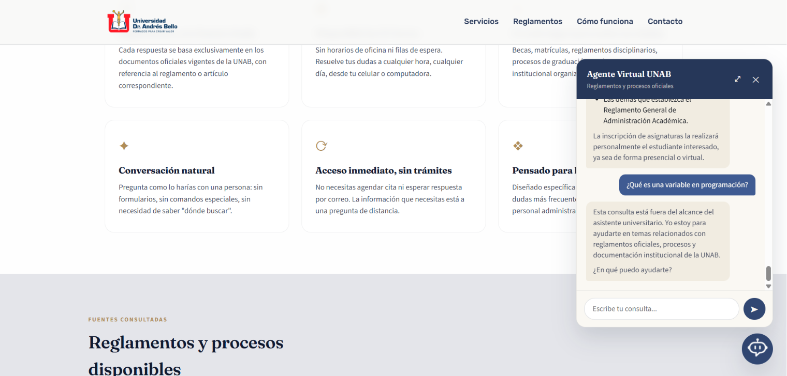
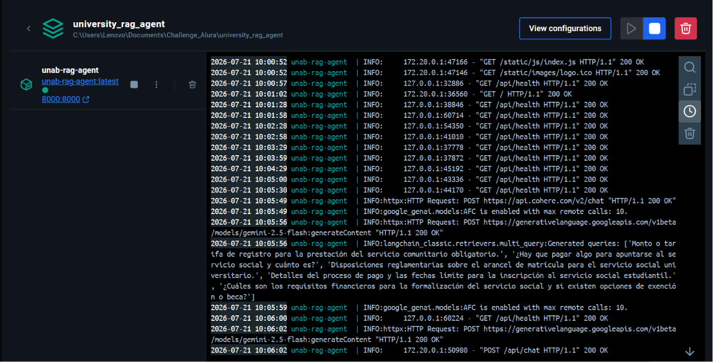

# Agente Virtual UNAB — Sistema RAG Institucional
 
Asistente virtual basado en **RAG (Retrieval Augmented Generation)** desarrollo 
para el Challenge Alura Agente. Responde exclusivamente con base en los
reglamentos y documentos oficiales indexados, citando la fuente cuando está
disponible, y se integra en una landing institucional con un widget de chat
flotante.
 
> El asistente **no inventa información ni completa con suposiciones**: si la
> consulta no corresponde a un tema institucional, o si los documentos
> oficiales no contienen la respuesta, lo indica explícitamente en vez de
> improvisar.
 
---

## Demo en vivo

🔗 **Agente desplegado:** [http://132.226.122.91:8000/](http://132.226.122.91:8000/)

> Desplegado en una instancia de Oracle Cloud Infrastructure (Compute,
> Oracle Linux 9).


## Tabla de contenidos
 
- [Descripción del proyecto](#descripción-del-proyecto)
- [Demo en vivo](#demo-en-vivo)
- [Pipeline RAG](#pipeline-rag)
- [Arquitectura](#arquitectura)
- [Tecnologías utilizadas](#tecnologías-utilizadas)
- [Estructura del proyecto](#estructura-del-proyecto)
- [Instalación local](#instalación-local)
- [Ingesta de documentos](#ingesta-de-documentos)
- [Despliegue con Docker](#despliegue-con-docker)
- [Referencia de la API](#referencia-de-la-api)
- [Ejemplos de preguntas y respuestas](#ejemplos-de-preguntas-y-respuestas)
- [Evidencias de funcionamiento](#evidencias-de-funcionamiento)
- [Nota sobre versiones de LangChain](#nota-sobre-versiones-de-langchain)
- [Notas de arquitectura](#notas-de-arquitectura)
---
 
 ## Descripción del proyecto
 
El **Agente Virtual UNAB** es un asistente conversacional que permite a
estudiantes, docentes y personal administrativo consultar en lenguaje
natural los reglamentos, circulares y procesos oficiales de la UNAB
(becas, matrícula, graduación, régimen académico, disciplina, etc.), sin
tener que buscar manualmente en documentos PDF extensos.
 
El sistema combina:
 
- Un **pipeline de recuperación de información (retrieval)** contra una base
  vectorial (Pinecone) construida a partir de los documentos oficiales.
- Un **clasificador de intención** (Cohere) que filtra preguntas fuera del
  alcance institucional antes de gastar recursos en la búsqueda.
- Un **generador de sub-consultas (multiquery)** y un **LLM de respuesta**
  (Gemini) que redactan la respuesta final citando el reglamento y artículo
  correspondiente cuando aplica.
- Una **landing institucional** con un widget de chat flotente, servidos
  ambos desde el mismo backend en FastAPI.


## Pipeline RAG

```

Usuario escribe una pregunta
        │
        ▼
1) Clasificador (Cohere)  ──► ¿Es un tema institucional?
                               │                     │
                               │ No                  │ Sí
                               ▼                     ▼
                  Mensaje "fuera de alcance"    2) MultiQueryRetriever (Gemini)
                  (no se gasta token en             genera 5 variaciones de la
                  multiquery ni se consulta        pregunta y recupera fragmentos
                  el vector store)                 desde Pinecone
                                                    │
                                          ¿Hay fragmentos relevantes?
                                            │                │
                                            No                Sí
                                            ▼                ▼
                                    Mensaje "contexto     3) Respuesta final (Gemini)
                                    insuficiente" +          con el prompt institucional
                                    datos de contacto        y el contexto recuperado

```
 
La clasificación con Cohere se ejecuta **antes** del multiquery para evitar
generar las 5 sub-consultas (y el gasto de tokens que implica) cuando la
pregunta claramente no es institucional.
 

## Arquitectura
 
El sistema está organizado en cuatro capas, cada una con una responsabilidad
única y bien delimitada: la capa de presentación (navegador), la capa de
aplicación (FastAPI), la capa de orquestación (lógica RAG) y la capa de
servicios externos (APIs de terceros y base vectorial). A esto se suma un
proceso independiente de ingesta de documentos, que no forma parte del ciclo
de vida de una petición de chat.
 
### 1. Capa de presentación (navegador)
 
Es lo que el usuario final ve y con lo que interactúa: la landing
institucional (`static/index.html` + `static/css/styles.css`) y el widget de
chat flotente (`static/js/chat.js`). Esta capa no contiene lógica de
negocio; su única responsabilidad es capturar la pregunta del usuario,
enviarla al backend mediante una petición `POST` a `/api/chat`, y renderizar
la respuesta recibida (incluyendo el formato Markdown de la respuesta del
LLM, procesado en el navegador con `marked.js`). También consume
`GET /` para cargar la landing y sus archivos estáticos.
 
### 2. Capa de aplicación (FastAPI)
 
Es el punto de entrada único del backend (`app/main.py`). Cumple tres
funciones:
 
- **Servir la landing y sus assets estáticos**, mediante `StaticFiles`
  montado en `/static` y una ruta explícita en `/` que devuelve
  `index.html`.
- **Exponer la API REST** (`app/api/routes.py`), con dos endpoints:
  `GET /api/health` para verificación de estado, y `POST /api/chat`, que
  recibe la pregunta del usuario y delega el procesamiento a la capa de
  orquestación.
- **Precargar los componentes pesados en el arranque**, mediante un evento
  `startup`: el clasificador, el retriever con multiquery y la cadena de
  respuesta se instancian una sola vez cuando el proceso arranca, en vez de
  inicializarse en la primera petición real de un usuario. Esto evita que
  el primer visitante del día pague el costo de cargar el modelo de
  embeddings y establecer los clientes de las APIs externas.
### 3. Capa de orquestación (lógica RAG)
 
Es el núcleo del agente, ubicado en `app/core/`. Se compone de cuatro
módulos que colaboran entre sí:
 
- **`prompts.py`** — contiene las tres plantillas de prompt del sistema: el
  prompt de clasificación (institucional / fuera de alcance), el prompt de
  generación de sub-consultas para el multiquery, y el prompt de respuesta
  final con el rol, tono, protocolo empático y reglas de formato del
  asistente institucional. No ejecuta lógica, solo define texto
  parametrizable.
- **`classifier.py`** — implementa el filtro de intención usando Cohere.
  Recibe la pregunta del usuario y determina si corresponde a un tema
  institucional o si está fuera del alcance del asistente, antes de que se
  invoque cualquier otro componente más costoso.
- **`vectorstore.py`** — gestiona la conexión con Pinecone y con el modelo
  de embeddings de HuggingFace. Expone el retriever base (búsqueda por
  similitud con `k` fragmentos configurable) que luego es envuelto por el
  multiquery.
- **`rag_chain.py`** — es el orquestador central: recibe la pregunta del
  usuario desde la API, invoca al clasificador, y solo si la pregunta es
  institucional continúa con el `MultiQueryRetriever` (que usa Gemini para
  generar cinco variaciones de la pregunta y así recuperar más fragmentos
  relevantes desde Pinecone). Con los fragmentos recuperados, arma el
  contexto y se lo pasa al LLM de respuesta (Gemini) junto con el prompt
  institucional, devolviendo la respuesta final junto con metadatos
  (clasificación resultante, si se usó multiquery, cantidad de fragmentos
  recuperados).
### 4. Capa de servicios externos
 
Son los sistemas de terceros que la capa de orquestación consume:
 
- **Cohere** — recibe únicamente la pregunta del usuario y el prompt de
  clasificación; responde con una palabra (`INSTITUCIONAL` o
  `FUERA_DE_ALCANCE`). Es la única llamada a un LLM que ocurre siempre, sin
  excepción, en cada consulta.
- **Google Gemini** — se invoca dos veces por consulta institucional: una
  primera vez para generar las cinco sub-consultas del multiquery, y una
  segunda vez para redactar la respuesta final con el contexto ya
  recuperado.
- **Pinecone** — almacena los vectores (embeddings) de los fragmentos de los
  documentos oficiales, junto con su metadata (texto original, fuente). Es
  consultado por el retriever tantas veces como sub-consultas genere el
  multiquery.
### 5. Proceso de ingesta (independiente del servicio web)
 
`app/ingestion/ingest.py` no forma parte del flujo de una petición de chat:
es un script que se ejecuta manualmente, de forma offline, cada vez que se
agregan o actualizan reglamentos oficiales. Su responsabilidad es cargar los
archivos PDF/TXT/MD de la carpeta `documentos/`, fragmentarlos con
chunking semántico (agrupando oraciones semánticamente relacionadas en un
mismo fragmento, en vez de cortar por una cantidad fija de caracteres), y
subir esos fragmentos ya vectorizados a Pinecone. Esta separación existe
porque el chunking semántico requiere calcular embeddings de todo el corpus
documental, una operación costosa que no debe repetirse en cada arranque
del servidor ni en cada consulta de un usuario.

## Tecnologías utilizadas
 
| Categoría | Tecnología | Uso en el proyecto |
|---|---|---|
| Backend / API | **FastAPI** + **Uvicorn** | Servidor web, landing y endpoints REST |
| Orquestación RAG | **LangChain** (`langchain`, `langchain-core`, `langchain-classic`, `langchain-community`) | Prompts, `MultiQueryRetriever`, cadenas de procesamiento |
| Chunking | **langchain-experimental** (`SemanticChunker`) | Fragmentación semántica de documentos |
| Embeddings | **langchain-huggingface** + `intfloat/multilingual-e5-small` | Vectorización de texto para búsqueda semántica |
| Base vectorial | **Pinecone** (`langchain-pinecone`) | Almacenamiento e indexación de fragmentos |
| Clasificación | **Cohere** (`langchain-cohere`, modelo `command-a-03-2025`) | Filtro de intención institucional / fuera de alcance |
| Generación | **Google Gemini** (`langchain-google-genai`, modelo `gemini-2.5-flash`) | Generación de sub-consultas (multiquery) y respuesta final |
| Configuración | **pydantic-settings** | Carga de variables de entorno tipadas |
| Carga de documentos | **pypdf** | Extracción de texto desde PDF |
| Frontend | HTML / CSS / JavaScript (sin frameworks) + **marked.js** | Landing institucional y widget de chat, renderizado de Markdown |
| Contenerización | **Docker** + **Docker Compose** | Empaquetado y despliegue reproducible |
| Infraestructura | **Oracle Cloud Infrastructure (OCI)** | Hosting en producción (Compute + Oracle Linux 9) |
 
## Estructura del proyecto
 
```
unab-rag-agent/
├── app/
│   ├── main.py                 # FastAPI: monta la landing y la API
│   ├── config.py                # Variables de entorno (pydantic-settings)
│   ├── api/
│   │   └── routes.py             # Endpoints /api/chat y /api/health
│   ├── core/
│   │   ├── prompts.py            # Prompts: respuesta, clasificador, multiquery
│   │   ├── classifier.py         # LLM de clasificación (Cohere)
│   │   ├── vectorstore.py        # Conexión a Pinecone + embeddings HF
│   │   └── rag_chain.py          # Orquestación del flujo RAG completo
│   ├── models/
│   │   └── schemas.py            # Esquemas Pydantic (request/response)
│   └── ingestion/
│       └── ingest.py             # Script offline: carga, chunking y upsert
├── static/
│   ├── index.html                # Landing institucional
│   ├── css/styles.css            # Estilos (landing + widget de chat)
│   └── js/chat.js                # Lógica del widget de chat
├── tests/
│   └── test_fetch_vector.py      # Prueba manual: fetch de un vector por ID
├── documentos/                   # Reglamentos oficiales (PDF/TXT/MD) — no versionado
├── requirements.txt
├── Dockerfile
├── docker-compose.yml
├── .dockerignore
├── .gitignore
├── .env.example
└── README.md
```

## Instalación local

### Prerrequisitos
 
- Python 3.11+
- Cuentas y API keys activas de: [Pinecone](https://www.pinecone.io/),
  [Google AI Studio](https://aistudio.google.com/) (Gemini) y
  [Cohere](https://cohere.com/).
- Un índice ya creado en Pinecone (dimensión acorde al modelo de embeddings
  `intfloat/multilingual-e5-small`, 384 dimensiones).
### Pasos
 
```bash
# 1. Clonar el repositorio
git clone https://github.com/tu-usuario/unab-rag-agent.git
cd unab-rag-agent
 
# 2. Crear y activar entorno virtual
python -m venv .venv
source .venv/bin/activate          # En Windows: .venv\Scripts\activate
 
# 3. Instalar dependencias
pip install -r requirements.txt
 
# 4. Configurar variables de entorno
cp .env.example .env
# Editar .env con tus API keys reales (Pinecone, Gemini, Cohere)
 
# 5. Levantar el servidor en modo desarrollo
uvicorn app.main:app --reload --host 0.0.0.0 --port 8000
```
 
Abre `http://localhost:8000` — deberías ver la landing institucional. El
botón azul en la esquina inferior derecha abre el chat del asistente.
 
## Ingesta de documentos
 
Coloca los reglamentos (`.pdf`, `.txt`, `.md`) dentro de `documentos/` y
ejecuta el script de ingestión (carga → chunking semántico → upsert a
Pinecone):
 
```bash
# Primera carga o para reemplazar todo el índice existente
python -m app.ingestion.ingest --reset
 
# Agregar nuevos documentos, pero si existe en la carpeta /documentos un archivo que ya esta indexado este se va a duplicar.
python -m app.ingestion.ingest
```
 
Este paso es **independiente** del servidor web: se corre manualmente cada
vez que se actualiza un reglamento, no en cada arranque de la aplicación.
 
Para verificar puntualmente que un fragmento quedó bien indexado, puedes
recuperarlo por su ID exacto directamente desde Pinecone:
 
```bash
python -m tests.test_fetch_vector <id-del-vector>
```
 
 ## Despliegue con Docker
 
```bash
docker compose build
docker compose up -d
 
# Ejecutar la ingesta dentro del contenedor (requiere PDFs en ./documentos)
docker compose exec unab-rag-agent python -m app.ingestion.ingest --reset
 
# Ver logs en vivo
docker compose logs -f
 
# Detener
docker compose down
```
 
La carpeta `documentos/` está montada como volumen (`./documentos:/app/documentos`),
por lo que se pueden actualizar los reglamentos sin reconstruir la imagen —
basta con copiar los nuevos archivos y volver a correr la ingesta.

## Referencia de la API
 
### `GET /api/health`
 
Verificación de estado del servicio.
 
```json
{ "status": "ok" }
```
 
### `POST /api/chat`
 
**Request:**
```json
{ "query": "¿Nota mínima para graduarme?" }
```
 
**Response:**
```json
{
  "answer": "Según el Reglamento de Régimen Académico...",
  "classification": "institucional",
  "used_multiquery": true,
  "num_fragments": 4
}
```

## Ejemplos de preguntas y respuestas
 
> Muestra casos reales de uso del asistente, una vez
> indexados los reglamentos oficiales de la universidad.
 
### Pregunta:
```
¿Cuándo son los primeros parciales del ciclo 2-2026?
```
**Respuesta del agente:** 
>Los primeros parciales para el Ciclo 02/2026 se llevarán a cabo en las siguientes fechas, dependiendo de la duración de tu ciclo académico:
>* **Para el ciclo de 16 semanas:** Del 31 de agosto de 2026 al 06 de septiembre de 2026.
>* **Para el ciclo de 20 semanas:** Del 07 de septiembre de 2026 al 13 de septiembre de 2026.
>
>Para poder realizar el primer parcial, es necesario haber cubierto la 2ª Cuota y los derechos de exámenes (para el ciclo de 16 semanas) o la 3ª Cuota y los derechos de >exámenes (para el ciclo de 20 semanas).

---

### Pregunta: 
```
¿Que documentos debo presentar para poder matricularme?
```
**Respuesta del agente:** 
>Para poder matricularte en la Universidad Doctor Andrés Bello (UNAB) y formalizar tu estatus como estudiante regular, debes cumplir con los requisitos de ingreso y el >pago de los aranceles establecidos, según el Artículo 29.
>
>A continuación, se detallan los documentos y requisitos específicos, dependiendo de tu situación:
>
>### 1. Documentos de Ingreso (Requisitos para la Admisión, Art. 8)
>Estos son los documentos generales que se requieren para la admisión, ya sea para estudios de pregrado o postgrado, y son un paso previo a la matrícula:
>
>**Para estudios de pregrado:**
>* Solicitud de ingreso.
>* Documento Único de Identidad (DUI): Original y una copia (o su equivalente si eres extranjero).
>* Título de bachillerato: Original y una copia, registrado en el Ministerio de Educación Ciencia y Tecnología (MINEDUCYT) (o su equivalente de estudio en el >extranjero).
>* Fotografía: Una fotografía tamaño cédula.
>* Certificación de notas: Original y una copia de la certificación de notas de la institución de procedencia registrada en el MINEDUCYT (esto es para ingreso por equivalencias).
>* Permiso para estudiar: Si eres extranjero, permiso para estudiar en el país.
>
>**Para profesionales que estudien postgrado:**
>* Solicitud de ingreso.
>* Documento Único de Identidad (DUI): Original y una copia (o su equivalente si eres extranjero).
>* Título de educación superior: Original y una copia, registrado en el Ministerio de Educación (o su equivalente de estudio en el extranjero).
>* Fotografía: Una fotografía tamaño cédula.
>* Certificación de notas: Original y una copia de la certificación de notas del título de educación superior registrada en el MINEDUCYT (o su equivalente de estudio en el extranjero).
>* Permiso para estudiar: Si eres extranjero, permiso para estudiar en el país.
>El proceso de ingreso puede realizarse de forma presencial o vía electrónica. En los casos que se requiera el documento original, será para confrontarlo con la copia y >verificar su fidelidad.
>
>### 2. Requisitos para Inscribir Asignaturas (Art. 34)
>Una vez cumplidos los requisitos de ingreso, para inscribir tus asignaturas (parte del proceso de matrícula) se requiere lo siguiente:
>
>**Estudiantes de nuevo ingreso:**
>* Presentar los documentos detallados en la solicitud de ingreso (mencionados en el punto 1).
>* Haber cancelado los aranceles establecidos por la UNAB.
>
>**Estudiantes de antiguo ingreso:**
>* Haber cancelado los aranceles establecidos por la UNAB.
>
>**Estudiantes de reingreso:**
>* Presentar los comprobantes citados para estudiantes de nuevo ingreso (documentos de la solicitud de ingreso y aranceles).
>* Estar solventes con la biblioteca.
>* Estar solventes con equipo y material de laboratorio, si fuera el caso.
>
>**Estudiantes con beneficios económicos (becas):**
>* Presentar copia de la constancia de renovación del beneficio, extendida por la Dirección de Atención al Estudiante a la Administración Académica.
>* Las demás solvencias enumeradas en los literales anteriores, cuando sea pertinente. Si la inscripción es en línea, deberás adjuntar este documento.
>
>**Estudiantes de nuevo ingreso que soliciten equivalencias:**
>* Llenar la solicitud respectiva de forma física o digital.
>* Anexar la certificación global de notas autenticada por el Ministerio de Educación, Ciencia y Tecnología.
>* Anexar los demás documentos de ingreso.
>
>**Para el estudio de equivalencias (Art. 12), además de lo anterior, se requiere:**
>* Llenar una solicitud de equivalencias.
>* Entregar la solicitud en Administración Académica Regional, acompañándola de:
>    * Original y fotocopia del título de bachiller debidamente autenticado por el Ministerio de Educación.
>    * Original y fotocopia de la certificación global autenticada de las calificaciones correspondientes a las materias que deseas que se comparen con las de la Universidad.
>    * Copia de los programas, temarios o documentación técnica que exprese los contenidos, objetivos y las unidades valorativas.
>* Las demás que establezca el Reglamento General de Administración Académica.
>
>La inscripción de asignaturas la realizará personalmente el estudiante interesado, ya sea de forma presencial o virtual.
>
---

### Pregunta:
```
¿Qué es una variable en programación?
```
**Respuesta del agente:** 
>Esta consulta está fuera del alcance del asistente universitario. Yo estoy para ayudarte en temas relacionados con reglamentos oficiales, procesos y documentación institucional de la UNAB.
>
>¿En qué puedo ayudarte?

---

## Evidencias de funcionamiento

### Landing institucional


### Widget de chat — respuesta institucional


### Widget de chat — consulta fuera de alcance


### Contenedor corriendo en Docker


 
## Nota sobre versiones de LangChain

El ecosistema LangChain migró de la serie `0.3.x` a `1.x` recientemente, y
`langchain-classic` (donde vive `MultiQueryRetriever`) solo existe desde la
versión `1.0.0`. Las versiones fijadas en `requirements.txt` fueron
verificadas resolviendo dependencias reales contra PyPI, sin conflictos.

Al instalar verás una advertencia de que `langchain-experimental` (usado
para `SemanticChunker`) está en proceso de discontinuación por parte del
equipo de LangChain. Sigue funcionando con las versiones fijadas, pero si
en el futuro deja de mantenerse, la alternativa es sustituir el chunking
semántico por `RecursiveCharacterTextSplitter` de `langchain-text-splitters`
(ya incluido en las dependencias), con un tamaño de chunk fijo en lugar de
basado en similitud semántica.

## Notas de arquitectura
 
- **Separación ingesta/servicio:** la carga y fragmentación semántica de
  documentos es costosa y solo debe ejecutarse cuando cambian los
  documentos oficiales, nunca en el camino crítico de una petición de chat.
- **Singletons con `lru_cache`:** los clientes de Pinecone, el modelo de
  embeddings y los LLM se instancian una sola vez por proceso y se
  precargan en el evento `startup` de FastAPI, para que la primera petición
  real no pague el costo de inicialización.
- **Cohere solo para clasificación, Gemini para multiquery y respuesta:**
  permite usar un modelo más económico para la decisión binaria
  "institucional / fuera de alcance" y reservar Gemini para las tareas que
  requieren mayor calidad de generación.
- **Fail-open del clasificador:** ante una respuesta ambigua del LLM de
  clasificación, se asume que la consulta sí es institucional, para no
  bloquear preguntas legítimas por un error de parsing.

---
 
Realizado por [Elias Antonio Oliva](https://github.com/EliasO23)